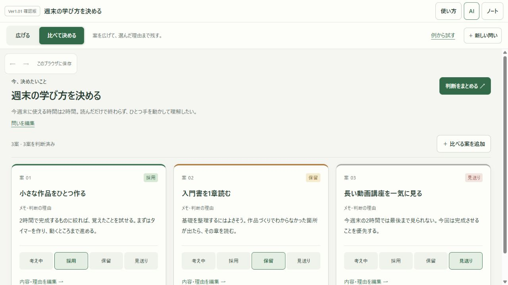

# 思考の芽 Ver1.01

背景比較（9月20日）：[3段階を実画面で比較](https://shiko-no-me-notebook.tokkey20.chatgpt.site/?background=preview)。Aかなり薄い・B薄い・C少し薄い。すべて従来より薄く、通常表示は暫定B。最終の濃さは本人の選択待ち。

追加公開（9月20日）：ドット方眼の背景、タブレットもPCと同じ左下の追加バー、枠の名前の直接編集。枠名はタップ→入力→Enter/外側で確定、Escapeで取消。枠を移動する場合は名前をドラッグします。

2026-09-20。**ショートカットまで公開済み。** [公開サイトを開く](https://shiko-no-me-notebook.tokkey20.chatgpt.site)。配布記録はLAUNCH-STATE.md。

同日追加公開：カード/分類枠の四つ角をドラッグしてサイズ変更できるようにしました。大きな四角いマークを外し、角付近ではカーソルが変わります。サイズ保存と取り消しにも対応。93テスト、ローカルPC実操作・390幅確認済み。[確認画面](docs/resize-corners.jpg)。

## 追加：カード操作のショートカット

1=採用、2=保留、3=見送り、0=考え中。Nで子カード、Shift+Nで同じ階層に追加。F2で編集、Fでボード全体、Vで比較とボードを切替。取り消し/やり直しも含めて、上部「キー操作」からキーの変更・解除・初期設定への復元ができます。設定はこのブラウザに保存。文章入力中は作動せず、ブラウザ操作と重なるキーや重複するキーは拒否します。追加後は88テスト成功。詳しい確認範囲はQA.md。

[キー設定の画面](docs/v1.01-shortcuts.jpg)

[確認用プレビューを開く](http://127.0.0.1:4191/?view=compare)

## 今回、何に使うアプリにしたか

**迷っている案を広げ、比べて決め、選んだ理由を持ち帰る。**

たとえば「次にどんな機能を作るか」「週末の2時間を何に使うか」。案がいくつか出たあとに、採用した理由と見送った理由を残し、次に迷ったときにも戻れるようにします。

カードやAIそのものは他のアプリにもあります。今回の差は、比較表や状態管理を自分で作らずに、ボードから候補比較、理由付きの文章まで進める操作です。他社に同様の用途が一切ないという主張ではありません。[公式情報による比較](docs/v1.01-competition.md)に根拠をまとめました。

## 触って分かる変更点（大きい順）

### 1. 「比べて決める」画面を追加

同じ問いから出た案を、理由と判断状態付きで並べます。その場で「採用・保留・見送り・考え中」を変更できます。複数案の採用も可能です。

カードから「内容・理由を編集」を押すと、PCでは右側の編集欄を開きます。理由を書き直すと比較画面へすぐ反映されます。さらに深い候補があるときは「この先の案を比べる」で進めます。別の問いへの切替時には前の編集欄を閉じ、編集対象が混ざらないようにしました。

### 2. 判断を文章で持ち帰れる

「判断をまとめる」から、問いの背景・採用・保留・見送り・考え中をまとめてコピー、または文章ファイルとして保存できます。書いていない理由を勝手に補わず、未記入と表示します。対象は現在比べている問いの直下の案です。

以前のJSON書き出しはバックアップとして残しています。今回の文章は、普段使うノートやチャットへ貼り付けるためのものです。

### 3. 始め方と編集入口を見える位置へ

上部に「広げる／比べて決める」「新しい問い」「例から試す」「使い方」を配置。新しい問いの入力欄には、問いと条件の具体例を出します。初めて開く確認環境では、理由まで入った記入例から始まります。

ボードには「選んだカードを編集」を追加。ダブルクリックを知らなくても編集へ進めます。線の色は編集欄の中で畳み、考え・理由・判断を先に読めるようにしました。接続線から色を変える既存操作では、その設定を開きます。

### 4. 往復して使うときの引っかかりを改善

- 長い理由はカード内でスクロールでき、判断ボタンが何画面も下へ押されません。
- PCでは横並び、スマホ幅では縦並び。保存表示が判断ボタンを覆わない配置にしました。
- 理由編集後は元のカードの操作へキーボード位置が戻ります。
- 案の追加を取り消しても、前に編集していたカードを変えません。
- 比較中に別ノートを作ってからボードへ戻っても、カードが画面に収まります。
- 判断変更・案追加・理由編集は既存の取り消しと自動保存を使います。

## 最初の3分で試す順番

1. 確認用プレビューの「例から試す」を押す。
2. 1つの案を「保留」から「採用」へ変え、「内容・理由を編集」で自分の理由を一行書く。
3. 「判断をまとめる」→「まとめをコピー」で、結果を確認する。
4. 「広げる」で同じ内容がボードにも残っていることを見る。
5. 「新しい問い」から、自分が実際に迷っていることを一つ試す。

## 確認した範囲

- ロジック：全82テスト成功。比較の単位・状態別まとめ・理由未記入・既存形式互換・非表示からのボード復帰など。
- 実操作：記入例開始、空の問い作成、案追加/取消、状態変更/Undo/Redo、理由編集、コピー、文章ファイル保存、保存後の再読込、比較とボードの往復。
- 視覚：1280×800と390×844で実画面を確認。390幅のページ横幅390px。判断ボタンは約75×44px。
- コピー完了表示後のクリップボード、ダイアログ本文、保存されたMarkdownファイルの本文一致を確認。
- 独立したコードUXレビューで3件を修正し、未解決High/MediumなしのPASS。別担当のデータ境界レビューも実施。
- 共有デモは閲覧専用を維持。比較しても判断変更・案追加はできません。

実スマホの手触り、日本語IME、スクリーンリーダー、実ユーザーの理解速度は未検証です。今回の確認版で競合に対する利用者評価まで実証したとは扱いません。

## 確認画面

[スマホ幅の確認画面](docs/v1.01-mobile.png)

## 公開と保存の状態

比較・判断まとめ・キー設定まで本番へ反映し、GitHub/Sites mainへpush済みです。公開サイトと確認用プレビューは保存先が別です。確認用で作ったノートとキー設定は、このPCの同じブラウザ・同じプレビューURLに保存され、本番へ自動移行しません。

起動をやり直す場合は、このリポジトリで `npm run build` のあとPowerShellで `$env:PORT='4191'; node server.mjs` を実行します。ブランチは `codex/ver1.01-decision-preview`。仕様はDESIGN.md、検証はQA.md、配布状態はLAUNCH-STATE.mdを正本とします。
